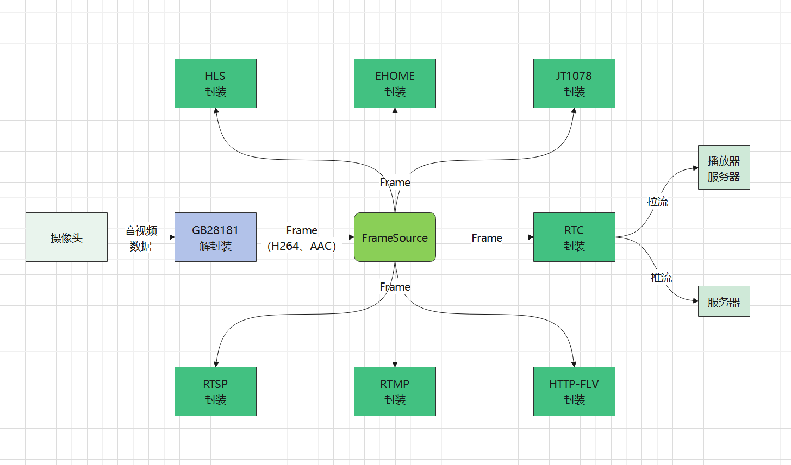

# SimpleMediaServer

#### 介绍
旨在开发一个可商用的，功能丰富、高性能、高可扩展的流媒体服务。支持RTSP、RTMP、WEBRTC、GB28181、HTTP-FLV、HLS、JT1078等协议。各个协议可以单独剥离出来，相互独立；也可以互相转换协议。
项目基于c++11开发，目前只支持Linux。

有兴趣一起开发开源项目或者想学习音视频技术的朋友欢迎进群（qq 362049849）。 动动小手帮忙点个star，谢谢。

#### 软件架构
1.协议转封装流程

#### 功能
- RTSP
    1. 作为服务端，支持客户端推拉流
    2. 作为客户端，支持向其他服务器推拉流
    3. 支持rtp over udp、tcp
    4. 支持rtp封装ps

- RTMP
    1. 作为服务端，支持客户端推拉流
    2. 作为客户端，支持向其他服务器推拉流

- GB28181
    1. 作为服务端，支持客户端推拉流
    2. 作为客户端，支持向其他服务器推拉流
    3. 支持rtp over udp、tcp

- WEBRTC
    1. 作为服务端，支持客户端拉流
    2. 作为服务端，支持客户端推流
    3. 作为客户端，向其他服务器推拉流

- HTTP-FLV
    1. 作为服务端，支持客户端拉流
    2. 作为客户端，向其他服务拉流

- HLS
    1. 作为服务端，支持客户端拉流
    2. 作为客户端，向其他服务拉流
    3. 支持实时hls（本人魔改的hls；Android微信可播；）

- HTTP-TS
    1. 作为服务端，支持客户端拉流
    2. 作为客户端，向其他服务拉流

- HTTP-PS
    1. 作为服务端，支持客户端拉流
    2. 作为客户端，向其他服务拉流

- SRT
    1. 作为服务端，支持客户端推拉流
    2. 作为客户端，向其他服务推拉流

- EHOME2
    1. 作为服务端，支持客户端推流(tcp)

- HTTPS
    1. https协议拉流，访问api，下载文件

- WEBSOCKET(ws/wss)
    1. 作为服务端，支持客户端拉流，如flv，ts等

- JT1078
    1. 作为服务端，支持客户端推流

- 点播
    1. ps
    2. MP4

- 录制
    1. ps
    2. MP4

#### 安装教程

1.  mkdir build
2.  cd build
3.  cmake ..
4.  make -j4
5.  如果需要ssl功能，将conf下的sms.com.crt和sms.com.key，拷贝到build目录
6.  如果需要前端页面实例，拷贝research到build目录，http的根目录默认是build
7.  gcc版本最好大于8
8.  如果不想编译源码，进群找我要二进制执行文件
9.  由于ffmpeg库太大，github上有限制上传不了。如果需要将ffmpeg编译进去，可以去gitee上下载（https://gitee.com/inyeme/simple-media-server）

#### 使用说明

1.  检查配置，如 server.conf,将其拷贝到build目录
2.  运行程序：./SimpleMediaServer
3.  用ffmpeg推流：ffmpeg -re -i inputfile -c copy -f flv rtmp://ip:port/live/test
4.  用vlc播放
- rtsp地址：rtsp://ip:port/live/test
- rtsp地址：rtsp://ip:port/live/test?type=ps（rtp封装ps）
- rtmp地址：rtmp://ip:port/live/test
- http-flv地址：http://ip:port/live/test.flv
- hls地址：http://ip:port/live/test.m3u8
- 实时hls地址: http://ip:port/live/test.sms.m3u8
- webrtc获取sdp：http://ip:port/api/v1/rtc/play
- srt: srt://ip:port?steamid=|path:/live/test|request:pull|

#### 说明文档
    更多使用说明，请查看Doc目录下的文档
