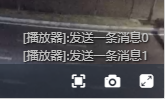

# SkeyeWebPlayer
#### 播放器介绍

[使用文档](https://openskeye.blog.csdn.net/article/details/124581886)

永久免费H5直播点播播放器，支持FLV、HLS、WS-FLV、WS-RTSP、HEVC/H265、WEBRTC 超低延迟，高效稳定。

2023-09-06 新增功能：
  * 新增.ts格式播放 如：http://192.168.31.142:8000/test.ts

2022-08-03 修改参数：
  * 参数 height:true 自动宽高16:9
  * 参数 height:false 宽高随外部容器宽高
    
        new WebMediaPlayer(url, `WebMediaPlayer`, this.callbackFunc, {
          cbUserPtr: this,
          decodeType: 'auto',
          height: true
        });
    

2022-07-13 新增：
 * $message 方法
 
        player.$message({
           duration: 0, // 显示时长 毫秒，自动销毁 0:不自动销毁，1000:1秒后自动销毁
           message: '[播放器]:发送一条消息' + this.num, // 消息内容
           callback: (index) => { // 回调 消息的index
    
           }
         })
         
     
         
 * $clearMessage 方法
 
        player.$clearMessage(index)  // 清除 index 传入返回的index，不传时删除全部消息
        
 

2022-06-20 新增：
 * 支持 WEBRTC 播放;

基础功能：
 * 具有 H.264 + AAC 编解码器播放功能
 * 支持Websocket-RTSP播放;
 * 支持 m3u8(HLS) 播放;
 * 支持 HTTP-FLV/WS-FLV 播放;
 * 支持 HEVC/H265 播放;
 * 支持直播和点播播放;
 * 支持全屏显示;
 * 支持重连播放；
 * HTTP FLV RTSP低延迟实时流播放 (HLS延时稍大一点，大概在5s—10s左右)
 * WS-FLV 通过 WebSocket 实时流播放
 * 支持全屏或比例显示;
 * 支持播放器快照截图;
 * 支持Android、iOS播放;

#### demo

#### 获取更多信息

邮件：[support@openskeye.cn](mailto:support@openskeye.cn) 

QQ交流群：102644504

**SkeyeVSS**[综合安防互联网无插件播放解决方案](http://www.openskeye.cn/web/product/vss?id=c24a0a06-6d38-45a5-8623-a1fa3f406ab1)

[openskeye官网](http://www.openskeye.cn)

Copyright &copy; OpenSkeye Team 2018-2022

